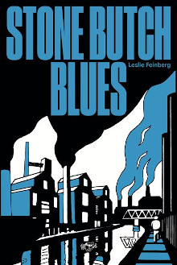
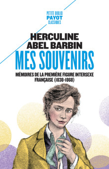

## Bibilography

The covers are the ones of the french edition if possible; otherwise it is the
english edition.

|  |  |  |  |  |
| :------------------------------------------: | :-----------------------------------------------: | :-------------------------------------: | :-------------------------------------: | :-------------------------------------: |
| [EN](https://www.goodreads.com/book/show/17602.Killing_Rage) / [FR](https://www.goodreads.com/book/show/160091979-rage-assassine) | [EN](https://www.iconbooks.com/ib-title/queer-a-graphic-history/) / [FR](https://www.editionsladecouverte.fr/queer_theory_une_histoire_graphique-9782348078453) | [EN](https://www.goodreads.com/book/show/139569.Stone_Butch_Blues) / [FR](https://fr.wikipedia.org/wiki/Stone_Butch_Blues) | [EN](https://www.goodreads.com/book/show/200686.Herculine_Barbin) / [FR](https://www.goodreads.com/book/show/11770400-mes-souvenirs) | [EN](https://www.goodreads.com/book/show/85767.Gender_Trouble#CommunityReviews) / [FR](https://www.editionsladecouverte.fr/trouble_dans_le_genre-9782707150189)